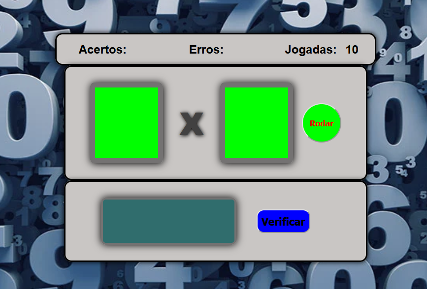

# <h1>tabuadaAleatoria</h1>
Projeto de tabuada parecido com jogo caça niquel onde os numeros saem aleatorios 
Projeto simples para colocar em pratica conteudos aprendidos ate agora HTML, CSS, JavaScript

## <h1>Image de Amostra</h1>

# <h1>Link de Acesso</h1>
<label>Linke de visualização -->></label> <a href="https://jailsonaraujo.github.io/tabuadaAleatoria/">Click Aqui</a>